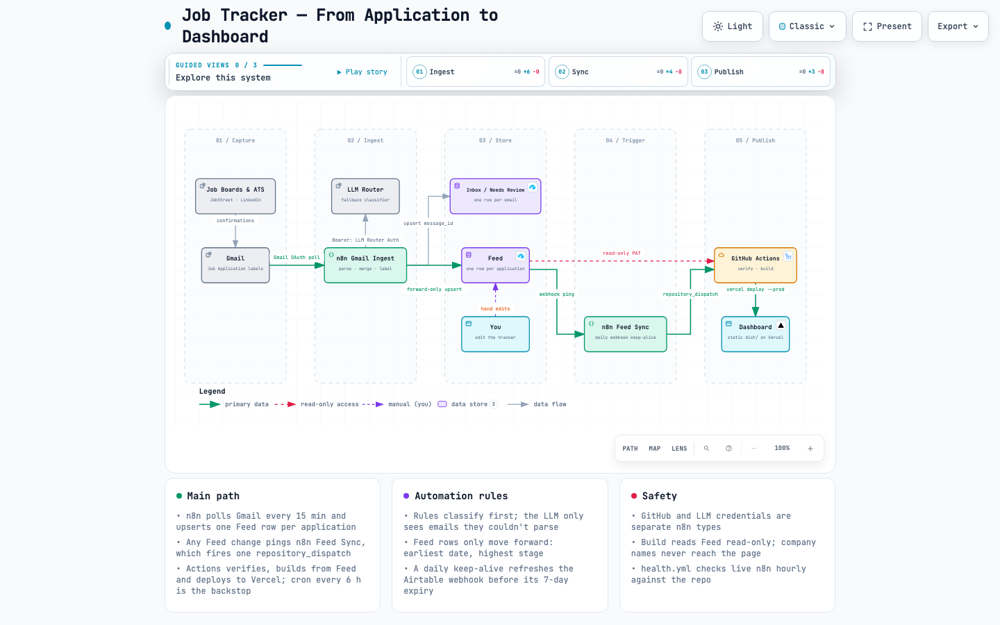

# Job Tracker

Gmail receives an application confirmation, n8n reads it, and a dashboard on Vercel updates
within the hour. No spreadsheet, no manual data entry beyond the parts that still need a person.


## Dashboard Preview


## About this project

Job Tracker turns job-application emails into a private, automated analytics dashboard. Gmail and n8n capture and classify application updates, Airtable stores the structured feed, and GitHub Actions builds and deploys a static dashboard to a VPS. It is dependency-free, privacy-conscious, and designed to make the job search easier to understand without adding more manual tracking.

## What it does

You apply for jobs the way you always have: LinkedIn, JobStreet, company career pages, cold
email. Every confirmation and status update that lands in Gmail under the `Job Application`
label, or matches phrases like "thank you for applying," gets picked up by n8n on a 15-minute
poll. n8n classifies the email, logs it, and upserts one row per application into an Airtable
table called `Feed`, filling in the job platform, the status, and how far the application got.
That last part used to be manual.

The merge never overwrites a status you've corrected by hand, and it never regresses one either.
A stray confirmation email that arrives after an interview invite won't knock a row back down to
"Applied." GitHub Actions reads `Feed` on a schedule, or the moment n8n triggers it, builds a
static dashboard from nine fields, and deploys it to Vercel. You still do the applying.
Everything after Gmail receives a reply runs on its own, short of the rare row you need to
correct by hand.

## Workflow



The [interactive version](docs/system-overview.html) has guided views for the capture, automate,
and publish stages, plus light/dark and pan/zoom. Open it if the picture above raises a question
the summary below doesn't answer.

Two tools split the work, and the seam between them is a single `repository_dispatch` call. n8n
handles the Gmail hop, where OAuth, retries, and dedupe already have solved answers; GitHub Actions
handles building and shipping a website, which n8n has no good answer for. Neither side
has to fake competence it doesn't have.

`Feed` doubles as the privacy boundary. It holds only the nine fields the dashboard reads, so a
leaked read-only API key scoped to `Feed` can't expose a company name or a note: those live in
`Inbox` and `Needs Review` instead, the message-level log n8n also writes to. Keeping the log
separate from the tracker means an automated write can never silently overwrite something you
typed by hand.

Full setup, including the Gmail label scheme and the n8n import: [DEPLOY.md](DEPLOY.md).

## Install

### 1. Create the Airtable base

Create a base with three tables: `Feed` (your tracker), `Inbox`, and `Needs Review`. See
[DEPLOY.md §3.1](DEPLOY.md) for the ingest tables' fields. `Feed` needs these nine fields, named
exactly:

| Field | Type |
|---|---|
| `Date Applied` | Date |
| `Source` | Single line text |
| `Work Setup` | Single line text |
| `Status` | Single select or single line text |
| `Resume` | Checkbox |
| `Cover Letter` | Checkbox |
| `Tailored` | Checkbox |
| `Next Follow Up` | Date |
| `Max Stage` | Number |

### 2. Create a personal access token

Airtable → your account → **Developer hub → Personal access tokens → Create token**. Scope it to
`data.records:read` on this base only. Airtable shows the token (`pat...`) once, so copy it now.

### 3. Add the GitHub secrets

**Settings → Secrets and variables → Actions → New repository secret:**

| Secret | Value |
|---|---|
| `AIRTABLE_API_KEY` | the token from step 2 |
| `AIRTABLE_BASE_ID` | from the base's API docs (**Help → API documentation**); looks like `appXXXXXXXXXXXXXX` |

`AIRTABLE_TABLE_NAME` is optional; it defaults to `Feed`.

### 4. Set up Vercel

[DEPLOY.md §2](DEPLOY.md) covers creating the project, turning off Deployment Protection, and
the access token. Then run **Actions → Build and deploy → Run workflow**. It ends by curling your
public URL and fails if the page isn't actually up.

### 5. Wire up n8n

[DEPLOY.md §3](DEPLOY.md) covers the Gmail labels, importing `n8n/job-tracker-ingest.json`, and
running the one-off backfill over mail that predates the workflow. §3.6 adds
`n8n/job-tracker-feed-sync.json`, which rebuilds the dashboard within seconds of any Feed
change, from a hand edit in Airtable or from the ingest.

## Usage

```bash
# build against the checked-in fixture: no network, no secret
FEED_FIXTURE=./sample-feed.json node scripts/build.mjs
open dist/index.html

# build against the real base
AIRTABLE_API_KEY=pat... AIRTABLE_BASE_ID=app... node scripts/build.mjs

# the pre-deploy gate; run this before every commit
node scripts/verify.mjs
```

No `npm install`. Node 20+, zero dependencies. `sample-feed.json` is a de-identified snapshot
(dates, sources, and statuses only), shaped like Airtable's list-records API response, so the
build is testable without touching the real base.

## Layout

| Path | What |
|---|---|
| `scripts/build.mjs` | Airtable → aggregate → Sankey layout → fill the template |
| `scripts/verify.mjs` | pre-deploy gate: funnel arithmetic, the privacy boundary, n8n invariants |
| `scripts/build-n8n.mjs` | generates `n8n/job-tracker-ingest.json` from the parser and merge code |
| `scripts/test-parser.mjs`, `scripts/test-merge-feed.mjs` | run the classifier and the Feed merge outside n8n |
| `n8n/parse-email.js` | the email classifier (edit this, never the generated JSON) |
| `n8n/merge-feed.js` | merges a parsed email into its `Feed` row, forward only |
| `n8n/gmail-labels.json` | Gmail label IDs the workflow applies |
| `templates/dashboard.html` | TailAdmin markup, Tailwind config, chart code |
| `data/summary.json` | aggregate counts, committed every run; git history is the time series |
| `sample-feed.json` | de-identified fixture for local dev and CI |
| `docs/system-overview.*` | the architecture diagram, source and rendered |
| `.github/workflows/deploy.yml` | verify, build, commit the summary, deploy, smoke-test |

## Troubleshooting

**"AIRTABLE_API_KEY / AIRTABLE_BASE_ID are not set"**: set both secrets, or build against the
fixture with `FEED_FIXTURE=./sample-feed.json`.

**"Airtable fetch failed: 401/403"**: the token lacks `data.records:read` on this base, or is
scoped to the wrong one.

**"Feed table returned zero records"**: wrong base or table ID, or `Feed` really is empty.

**Month chart is empty, everything else works.** `Date Applied` isn't a real Date field in
Airtable, so it doesn't match `YYYY-MM-DD`.

**Charts are blank but the tiles show numbers.** ApexCharts didn't load from cdnjs. The Sankey
survives because it's server-rendered SVG.

**Scheduled runs stopped after a couple of months.** GitHub disables cron after 60 days of repo
inactivity. The `data/summary.json` commit exists to prevent exactly this.

**The schedule runs late.** Expected: Actions cron is best-effort. Treat it as "a few times a
day," never "on the hour."

## TODO

- Row-per-application matching in `Inbox`, blocked on fuzzy company/title matching, which is a
guess a log shouldn't be making
- Commit row-level history instead of daily aggregates, once the privacy tradeoff is settled
- Time-in-stage analytics, once there's a month or so of committed history to compute it from

## Status

Active, single maintainer, running against one person's real job search. No external
contributions expected.
