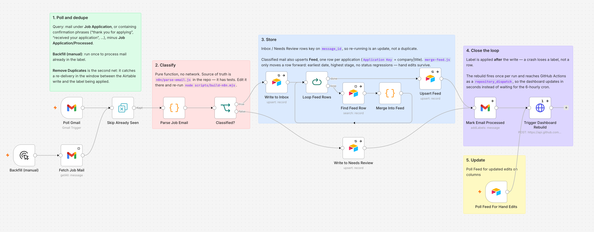
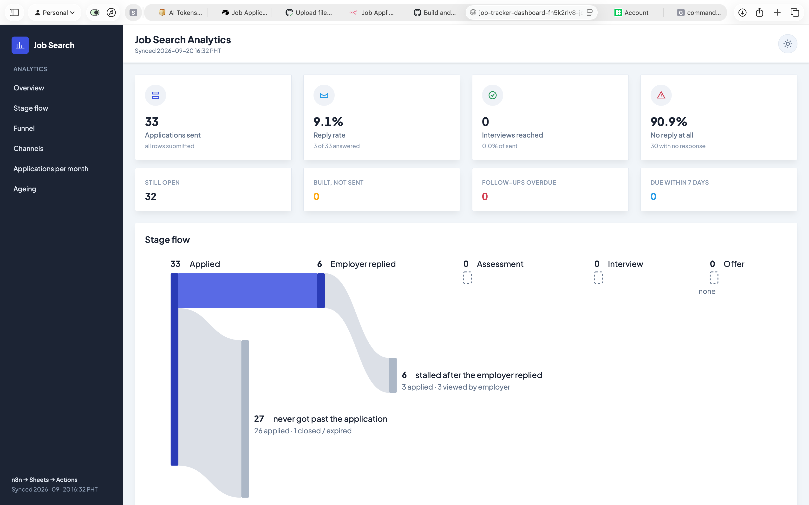

# Job Tracker

Gmail receives an application confirmation, n8n reads it, and a dashboard on Vercel updates
within minutes. No spreadsheet, no manual data entry beyond the parts that still need a person.



## Dashboard Preview




## About this project

Job Tracker turns job-application emails into a private, automated analytics dashboard. Gmail and n8n capture and classify application updates, Airtable stores the structured feed, and GitHub Actions builds and deploys a static dashboard to Vercel. It is dependency-free, privacy-conscious, and designed to make the job search easier to understand without adding more manual tracking.

## What it does

You apply for jobs the way you always have: LinkedIn, JobStreet, company career pages, cold
email. Every confirmation and status update that lands in Gmail under the `Job Application`
label, or matches phrases like "thank you for applying," gets picked up by n8n on a 15-minute
poll. n8n classifies the email with pattern rules, logs it, and upserts one row per application
into an Airtable table called `Feed`, filling in the job platform, the status, and how far the
application got. That last part used to be manual.

When the rules can't classify an email, an LLM gets one try, through any OpenAI-compatible
endpoint. Its answer is capped at medium confidence and can never override a rules match. A
malformed or unrecognized reply leaves the email unclassified. An email that's still
unclassified, or that doesn't name the employer (Indeed confirmations never do), goes to a
`Needs Review` table instead of `Feed`. Without a company there's no key that a later email
about the same job could match.

The merge never overwrites a status you've corrected by hand, and it never regresses one either.
A stray confirmation email that arrives after an interview invite won't knock a row back down to
"Applied." Rows are matched on an `Application Key` (`company|job title`), ignoring case and
spacing around the `|`, so a key you typed by hand and one n8n generated are the same
application.

Any change to `Feed`, whether from n8n or from you editing it in Airtable, triggers an Airtable
webhook. The webhook tells GitHub Actions to rebuild within seconds, and a 6-hourly schedule
catches anything missed. The build reads nine fields and deploys a static dashboard to Vercel.
An hourly health check compares the live n8n instance against this repo and emails you when
anything is stuck, drifted or failing. You still do the applying. Everything after Gmail
receives a reply runs on its own, short of the rare row you need to correct by hand.

The dashboard shows a stage-flow Sankey that splits each stage's losses into stalled (no reply)
and rejected. It also has per-stage conversion rates and monthly volume. If a tab has been open
while a newer build shipped, it shows a banner to reload.

## Workflow


The [interactive version](docs/system-overview.html) has guided views for the capture, automate,
and publish stages, plus light/dark and pan/zoom. Open it if the picture above raises a question
the summary below doesn't answer.

Two tools split the work, and the seam between them is a single `repository_dispatch` call. n8n
handles the Gmail hop, where OAuth, retries, and dedupe already have solved answers; GitHub Actions
handles building and shipping a website, which n8n has no good answer for. Neither side
has to fake competence it doesn't have. n8n runs two workflows, both generated from this repo:
the ingest (Gmail → `Inbox`/`Needs Review`/`Feed`) and the Feed sync (Airtable webhook →
`repository_dispatch`, plus a daily keep-alive, because Airtable expires webhooks after 7 days).

The privacy boundary is the build, not the base. `Feed` also stores `Company`, `Job Role` and
`Application Key`, because n8n needs them to match emails to rows. `scripts/build.mjs` reads
only the nine fields listed below, and `verify.mjs` fails if that list ever grows to include
one of the identifying fields. It also searches the built `dist/` for company names and email
addresses. That's why this repo, and the page, can be public. `Inbox` and `Needs Review` are
the message-level log: one row per email. Keeping the log separate from the tracker means an
automated write can never silently overwrite something you typed by hand.

Full setup, including the Gmail label scheme and the n8n import: [DEPLOY.md](DEPLOY.md).

## Install

### 1. Create the Airtable base

Create a base with three tables: `Feed` (your tracker), `Inbox`, and `Needs Review`. The
dashboard reads these nine `Feed` fields, named exactly:

| Field | Type |
|---|---|
| `Date Applied` | Date |
| `Source` | Single line text |
| `Work Setup` | Single line text |
| `Status` | Single select or single line text |
| `Resume` | Checkbox |
| `Cover Letter` | Checkbox |
| `Tailored` | Checkbox |
| `Next Follow Up` | Date |
| `Max Stage` | Number |

n8n also needs `Job Platform`, `Company` and `Application Key` on `Feed`, plus the fields of the
two log tables. [DEPLOY.md §3.1](DEPLOY.md) has all of them.

### 2. Create a personal access token

Airtable → your account → **Developer hub → Personal access tokens → Create token**. Scope it to
`data.records:read` on this base only. Airtable shows the token (`pat...`) once, so copy it now.

### 3. Add the GitHub secrets

**Settings → Secrets and variables → Actions → New repository secret:**

| Secret | Value |
|---|---|
| `AIRTABLE_API_KEY` | the token from step 2 |
| `AIRTABLE_BASE_ID` | from the base's API docs (**Help → API documentation**); looks like `appXXXXXXXXXXXXXX` |

`AIRTABLE_TABLE_NAME` is optional; it defaults to `Feed`. Deploying also needs `VERCEL_TOKEN`,
`VERCEL_ORG_ID` and `VERCEL_PROJECT_ID`. The health check needs `N8N_API_URL` and
`N8N_API_KEY`. Add those two before `health.yml` is on `main`, or it fails every hour until you
do. All seven are in [DEPLOY.md §2.5](DEPLOY.md).

### 4. Set up Vercel

[DEPLOY.md §2](DEPLOY.md) covers creating the project, turning off Deployment Protection, and
the access token. Then run **Actions → Build and deploy → Run workflow**. It ends by
smoke-testing the URL of the deployment it just made, and fails if the page isn't actually up.

### 5. Wire up n8n

[DEPLOY.md §3](DEPLOY.md) covers the Gmail labels, importing `n8n/job-tracker-ingest.json`, and
running the one-off backfill over mail that predates the workflow. It also covers the
credentials, including the LLM fallback's Bearer token. §3.6 adds
`n8n/job-tracker-feed-sync.json`, which rebuilds the dashboard within seconds of any Feed
change, from a hand edit in Airtable or from the ingest. §3.8 turns on the hourly health check.

## Usage

```bash
# build against the checked-in fixture: no network, no secret
FEED_FIXTURE=./sample-feed.json node scripts/build.mjs
open dist/index.html

# build against the real base
AIRTABLE_API_KEY=pat... AIRTABLE_BASE_ID=app... node scripts/build.mjs

# the pre-deploy gate; run this before every commit
node scripts/verify.mjs

# the pieces it tests, one at a time
node scripts/test-parser.mjs         # email classifier
node scripts/test-merge-feed.mjs     # forward-only Feed merge
node scripts/test-llm-fallback.mjs   # LLM fallback

# after editing anything in n8n/, regenerate both workflows, then re-import them
node scripts/build-n8n.mjs

# compare the live n8n instance against the generated workflows
N8N_API_URL=https://n8n.example.com N8N_API_KEY=... node scripts/check-live.mjs
```

No `npm install`. Node 20+, zero dependencies. `sample-feed.json` is a de-identified snapshot
(dates, sources, and statuses only), shaped like Airtable's list-records API response, so the
build is testable without touching the real base.

## Layout

| Path | What |
|---|---|
| `scripts/build.mjs` | Airtable → aggregate → Sankey layout → fill the template |
| `scripts/verify.mjs` | pre-deploy gate: funnel arithmetic, the privacy boundary, n8n invariants |
| `scripts/build-n8n.mjs` | generates both n8n workflows from the code in `n8n/*.js` |
| `scripts/check-live.mjs` | compares the running n8n instance to the generated workflows |
| `scripts/test-*.mjs` | run the classifier, Feed merge, LLM fallback, webhook keep-alive and live check outside n8n |
| `n8n/parse-email.js` | the email classifier (edit this, never the generated JSON) |
| `n8n/llm-fallback.js` | LLM classification for emails the rules couldn't parse |
| `n8n/merge-feed.js` | merges a parsed email into its `Feed` row, forward only |
| `n8n/airtable-webhook.js` | the Feed webhook keep-alive's decision: create, refresh or re-enable |
| `n8n/gmail-labels.json` | Gmail label IDs the workflow applies |
| `n8n/job-tracker-ingest.json`, `n8n/job-tracker-feed-sync.json` | generated workflows to import; never hand-edit |
| `templates/dashboard.html` | TailAdmin markup, Tailwind config, chart code |
| `icons8.json` | locks the Icons8 pack and icon ids the dashboard uses |
| `data/summary.json` | aggregate counts, committed every run; git history is the time series. Also shipped in `dist/` for the new-data banner |
| `sample-feed.json` | de-identified fixture for local dev and CI |
| `docs/system-overview.*` | the architecture diagram, source and rendered |
| `.github/workflows/deploy.yml` | verify, build, commit the summary, deploy, smoke-test |
| `.github/workflows/health.yml` | hourly `check-live.mjs` run; a failure emails you |

## Troubleshooting

**"AIRTABLE_API_KEY / AIRTABLE_BASE_ID are not set"**: set both secrets, or build against the
fixture with `FEED_FIXTURE=./sample-feed.json`.

**"Airtable fetch failed: 401/403"**: the token lacks `data.records:read` on this base, or is
scoped to the wrong one.

**"Feed table returned zero records"**: wrong base or table ID, or `Feed` really is empty.

**Month chart is empty, everything else works.** `Date Applied` isn't a real Date field in
Airtable, so it doesn't match `YYYY-MM-DD`.

**Charts are blank but the tiles show numbers.** ApexCharts didn't load from cdnjs. The Sankey
survives because it's server-rendered SVG.

**Scheduled runs stopped after a couple of months.** GitHub disables cron after 60 days of repo
inactivity. The `data/summary.json` commit exists to prevent exactly this.

**The schedule runs late.** Expected: Actions cron is best-effort. Treat it as "a few times a
day," never "on the hour." Feed changes don't wait for it: the webhook rebuilds within seconds.

**Edits in Airtable only show up on the 6-hourly run.** The Feed webhook lapsed. Webhooks
expire 7 days after they're created or last refreshed, and Airtable turns off notifications
after about a day of failed pings. Check the Feed sync workflow's **Daily Keep-Alive**
executions, and that n8n's Airtable token has `webhook:manage`
([DEPLOY.md §3.6](DEPLOY.md)).

**The "n8n health" workflow is failing.** Read its log. It names the problem: a workflow that
differs from the repo, is inactive or duplicated, or had error executions. That includes the
ingest's **Stale Job Mail Alarm**, which fires when job mail is still unprocessed after 2h. For
drift, regenerate and re-import ([DEPLOY.md §3.7](DEPLOY.md)); don't patch it in the n8n UI.

**The same application has two `Feed` rows.** Their `Application Key`s differ by more than case
and spacing around `|`, for example `Acme Corporation` vs `Acme`. Fix one key by hand to match
the other, then delete the extra row.

## TODO

- Row-per-application matching in `Inbox`, blocked on fuzzy company/title matching, which is a
guess a log shouldn't be making
- Commit row-level history instead of daily aggregates, once the privacy tradeoff is settled
- Time-in-stage analytics, once there's a month or so of committed history to compute it from

## Status

Active, single maintainer, running against one person's real job search. No external
contributions expected.
